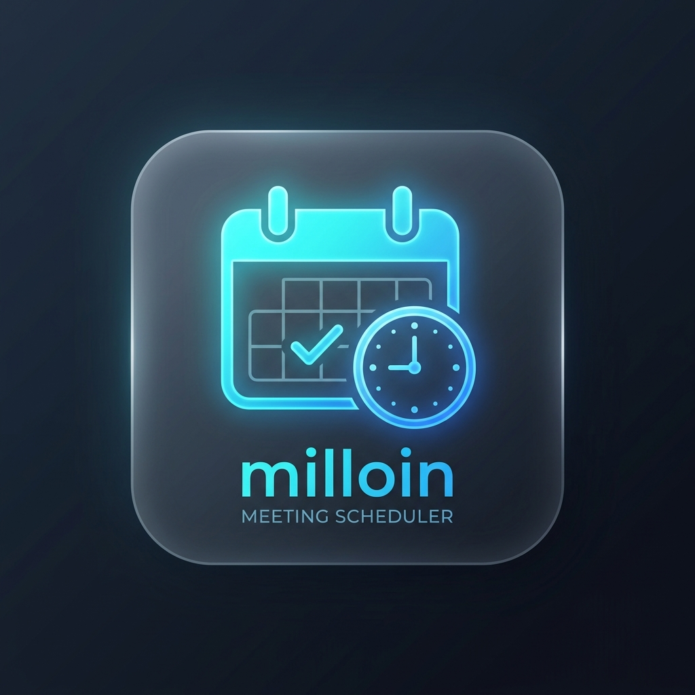

<div align="center">
  
  
  # milloin.fi

  **Kevyt, ilmainen ja nopea aikaehdotusten sopimistyökalu ilman kirjautumista.**

  [](./LICENSE)
  [](https://beckot.github.io/milloin/)
  [](./worker)
  [](./frontend)

</div>

---

## 💡 Miksi milloin?

Doodle on suosittu, mutta maksullinen, täynnä mainoksia ja vaatii usein kirjautumisen. **milloin** on suomalaiseen makuun suunniteltu yksinkertainen vaihtoehto:

- **Ei kirjautumista**: Luo kysely sekunneissa ilman tunnuksia.
- **Yksityinen & Maksuton**: Ei mainoksia, evästehuijauksia tai tiedonkeruuta.
- **Automatisoitu yhteenveto**: Näet yhdellä silmäyksellä suosituimman ajan.
- **Kaksivaiheinen tila**: Mukana valinnainen paikallistilan automaattinen varajärjestelmä (Offline Local Storage Fallback), joten sovellus toimii heti ilman palvelinasennustakin.

---

## 🛠️ Sovellusarkkitehtuuri

```
+-------------------------------------------------------------------+
|                  GitHub Pages (Static Web UI)                     |
|  - Moderni lasimorfismiteema (Dark Mode)                          |
|  - Suomenkielinen käyttöliittymä (Europe/Helsinki aikavyöhyke)    |
|  - In-Memory & LocalStorage automaattinen varatila                 |
+---------------------------------+---------------------------------+
                                  |
                           HTTPS REST API
                                  |
                                  v
+-------------------------------------------------------------------+
|               Cloudflare Worker (Serverless API)                  |
|  - Hono REST Framework (TypeScript)                               |
|  - Cloudflare Turnstile -näkemätön bot- ja spamsuojaus            |
|  - Luojan hallintatunnistimen (Admin Token) tarkistus             |
+---------------------------------+---------------------------------+
                                  |
                                  v
+-------------------------------------------------------------------+
|               Cloudflare D1 (Relational SQLite DB)                |
|  - Kyselyt, aikaehdotukset, osallistujat ja sopivuusäänet        |
+-------------------------------------------------------------------+
```

---

## 🚀 Kehittäjän pika-aloitus (Local Dev)

### Esivaatimukset
- **Node.js**: v18.0 tai uudempi
- **npm**: v9.0 tai uudempi

### 1. Käynnistä frontend (Vite)

```bash
# Siirry frontend-hakemistoon
cd frontend

# Asenna riippuvuudet
npm install

# Käynnistä kehityspalvelin (http://localhost:5173/milloin/)
npm run dev
```

> **Vinkki:** Frontend sisältää automaattisen *Local Storage Fallback* -tilan, joten voit luoda kyselyitä ja äänestää välittömästi ilman taustapalvelinta.

### 2. Käynnistä backend-palvelin (Cloudflare Worker API)

```bash
# Siirry worker-hakemistoon toisessa terminaalissa
cd worker

# Asenna riippuvuudet
npm install

# Käynnistä paikallinen Cloudflare Worker + paikallinen D1 SQLite -tietokanta
npm run dev
```

Kehityspalvelin käynnistyy osoitteeseen `http://127.0.0.1:8787`.

---

## 🧪 Kääntäminen ja tyyppitarkistus

Testaa sekä käyttöliittymän että taustapalvelimen virheettömyys ennen sitomista (commit):

```bash
# 1. Käännä frontend tuotantoversioon
cd frontend
npm run build

# 2. Tarkista Workerin TypeScript-tyypit
cd ../worker
npx tsc --noEmit
```

---

## 🌐 Tuotantojulkaisu (GitHub Pages & Cloudflare)

### Frontend (GitHub Pages)
1. Avaa GitHub-repositorio: [github.com/beckot/milloin](https://github.com/beckot/milloin)
2. Siirry kohtaan **Settings** -> **Pages**.
3. Valitse **Source** -> **GitHub Actions**.
4. Aina kun koodi työnnetään `main`-haaraan, `.github/workflows/deploy-frontend.yml` rakentaa ja julkaisee sivuston automaattisesti osoitteeseen `https://beckot.github.io/milloin/`.

### Backend (Cloudflare Worker & D1)
1. Luo ilmainen D1-tietokanta Cloudflaressa:
   ```bash
   cd worker
   npx wrangler login
   npx wrangler d1 create milloin-db
   ```
2. Päivitä luotu `database_id` tiedostoon [`worker/wrangler.jsonc`](file:///C:/Users/otbecker/dev/milloin/worker/wrangler.jsonc).
3. Aja tietokantamigraatio ja julkaise rajapinta:
   ```bash
   npx wrangler d1 execute milloin-db --file=./schema.sql
   npx wrangler deploy
   ```

---

## 📄 Lisenssi

[MIT License](./LICENSE) © Becker Otto
